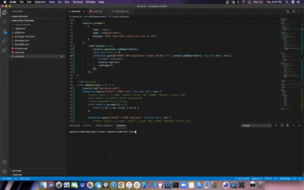
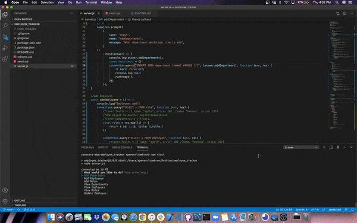
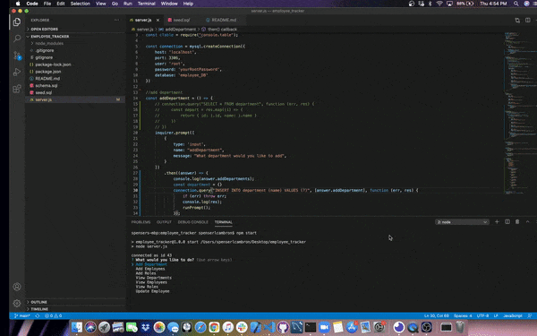

# employee_tracker

## Introduction
This employee tracker allows the user to manage their employess, the roles, of their employes, and add employees. The user is able to set what department the emoloyee is in, the salary, their title, and who that employees manager is. THe user is able to do all of this from the command-line.

## Installation
To install this application and use the command-line, install  npm, inquirer, console.table, and mysql. After that, the user needs to run npm start and follow the prompts.

